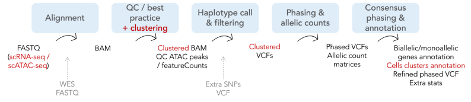

# SingleCellAnalysis

Snakemake workflow for the analysis and integration of scRNA-seq and scATAC-seq data.



## Input files needed

As input are needed the gzipped fastq file of *one* sample (possibility to input multi-lane fastq). 

## Reference files preparation

Most of the scATAC-seq data analysis based on the [scATAC-pro](https://github.com/wbaopaul/scATAC-pro) tool. 
For this reason need to adapt also [config/scATACconfig.txt](config/scATACconfig.txt) file. Moreover needed annotation files available at scATAC-pro github page, here reported in the [scATAC-pro_annotation](scATAC-pro_annotation) folder.

### Genome gtf and fa
Files available on [Ensembl web site](https://www.ensembl.org/Homo_sapiens/Info/Index).

GRCh38 download:

```bash 
wget http://ftp.ensembl.org/pub/release-107/gtf/homo_sapiens/Homo_sapiens.GRCh38.107.chr.gtf.gz
gzip -d Homo_sapiens.GRCh38.107.chr.gtf.gz
wget http://ftp.ensembl.org/pub/release-107/fasta/homo_sapiens/dna/Homo_sapiens.GRCh38.dna.primary_assembly.fa.gz
gzip -d Homo_sapiens.GRCh38.dna.primary_assembly.fa.gz
```
Add file paths to [config file](config/config.yaml) in `genome_gtf` and `genome_fa`

### Hisat2
Prepare [hisat2](https://www.nature.com/articles/s41587-019-0201-4) index files available [here](http://daehwankimlab.github.io/hisat2/download/) for download or preparation instructions with custom reference available [here](http://daehwankimlab.github.io/hisat2/howto/#build-hgfm-index-with-snps-and-transcripts). 

For an example look at this [file](hisat_indexes.sh).

### Strelka

Download and save Strelka executable (instructions available [here](https://github.com/Illumina/strelka/blob/v2.9.x/docs/userGuide/quickStart.md#strelka-quick-start), version used 2.9.10-1).

### Other reference files 

dbSNPs for variant calling with Shapeit4 available [here]()


<details><summary>GRCh38 download example </summary>
<p> 

```bash 
for i in {1..22} X;do wget http://ftp.1000genomes.ebi.ac.uk/vol1/ftp/data_collections/1000G_2504_high_coverage/working/20220422_3202_phased_SNV_INDEL_SV/1kGP_high_coverage_Illumina.chr$i.filtered.SNV_INDEL_SV_phased_panel.vcf.gz; done

for i in {1..22} X; do wget http://ftp.1000genomes.ebi.ac.uk/vol1/ftp/data_collections/1000G_2504_high_coverage/working/20220422_3202_phased_SNV_INDEL_SV/1kGP_high_coverage_Illumina.chr$i.filtered.SNV_INDEL_SV_phased_panel.vcf.gz.tbi; done
```

</p>
</details>

## How to run

```bash
snakemake --cores [cores_number] --use-conda --use-singularity
```

## Results architecture

<details><summary>Resuts organization </summary>
<p> 

```bash 
 results_ID/
 ├── gex
 │   ├── ASEChrom #ASE counts tables, one directory for chromosome
 │   │   └── cluster1.table
 │   │   └── cluster2.table
 │   ├── data_by_clusters #alignment by cell clusters
 │   │   ├── cluster1.bam
 │   │   └── cluster2.bam
 │   ├── alignment #RNA-seq alignment file after all QC
 │   │   └── gex.positionsort.bam
 │   ├── umitools_extr #extraction of valid cell barcodes 
 │   │   ├── merged_R1_extracted.fastq.gz
 │   │   ├── merged_R2_extracted.fastq.gz
 │   │   └── whitelist_umitools.txt
 │   ├── variant_calling #RNA-seq alignment file after all QC
 │   │   └── strelka
 │   │       └── variantsQC.vcf.gz
 │   └── features #feature counts and cell clustering results
 │       ├── cluster_gex.tsv
 │       └── counts.tsv.gz
 ├── gex_bulk #pseudo bulk RNA-seq analysis 
 │   ├── ASEchrom
 │   ├── alignment
 │   └── variant_calling
 ├── merged_vcf #merged het SNPs from all the technology analysed
 │   └── variantsQC.vcf.gz
 └── phased #haplotype phasing results on merged_vcf
     ├── haptreex.tsv
     ├── manual_refinment.vcf.gz
     └── shapeit_whatshap.vcf.gz
```

</p>
</details>
